
<h1 align="center">校园交友网站</h1>

## 简介
校园交友网站：角色分为管理员、用户；功能包括用户注册与登录、个人资料管理、好友推荐、即时聊天、活动发布与参与、信息管理与审核、交流论坛管理等，促进校园内社交互动与活动参与。    --计算机毕业设计源码；毕设源码；java毕业设计源码

## 联系方式

<h3 align="center">获取完整代码与数据库文件 + 微信：deepguan QQ: 86050149 QQ群: 783742310</h3>

<h3 align="center">可帮忙远程部署 包运行成功！提供远程部署、修改代码、设计文档指导、代码讲解等服务！</h3>

## 功能介绍（完整见运行截图）
管理员： 登录和管理校园交友网站的各项功能模块，包括用户管理、线下活动管理、交友信息管理、交流论坛和系统管理等。通过用户信息管理界面查看、修改、删除用户资料，审核用户发布的内容，便于维护平台秩序。 同时可以通过后台管理界面添加或修改网站内容，上传图片和填写公告信息，并可调节轮播图，确保网站信息的更新和准确呈现。

用户： 注册和登录账户后，可使用校园交友网站的各个功能板块，包括填写和编辑个人资料，添加好友以及参与即时聊天。 浏览好友推荐和发布校园活动，提升个人的社交活跃度。 用户还可以参与交流论坛，发表和评论帖子，在个人中心查看和管理已发布的内容、收藏和报名参加的活动。通过个人中心修改个人信息，增强互动体验和人际关系。

## 运行截图
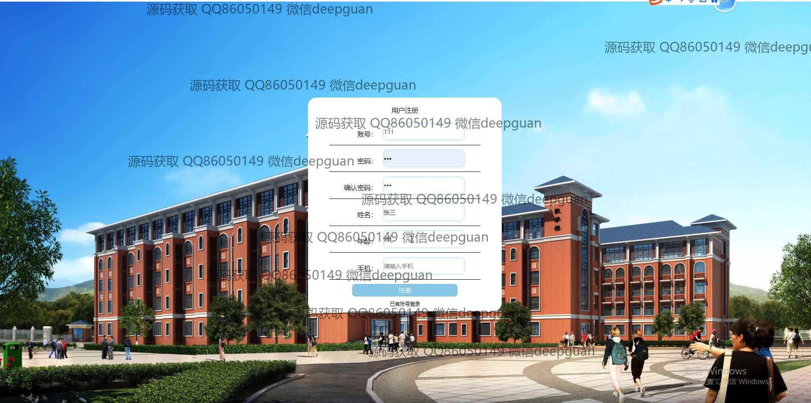

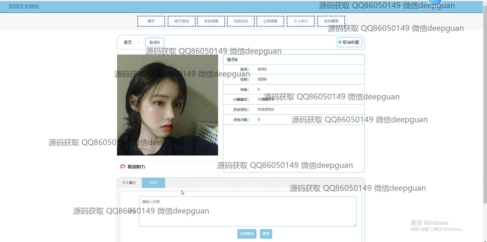
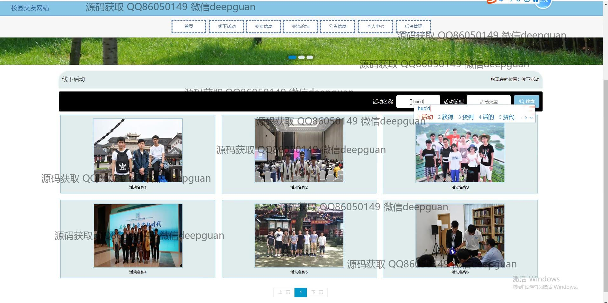
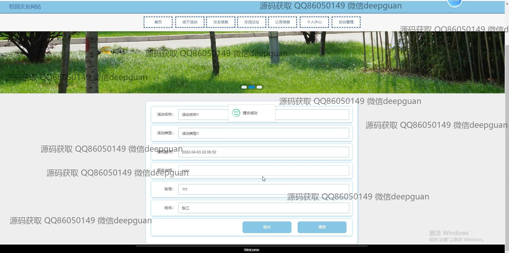
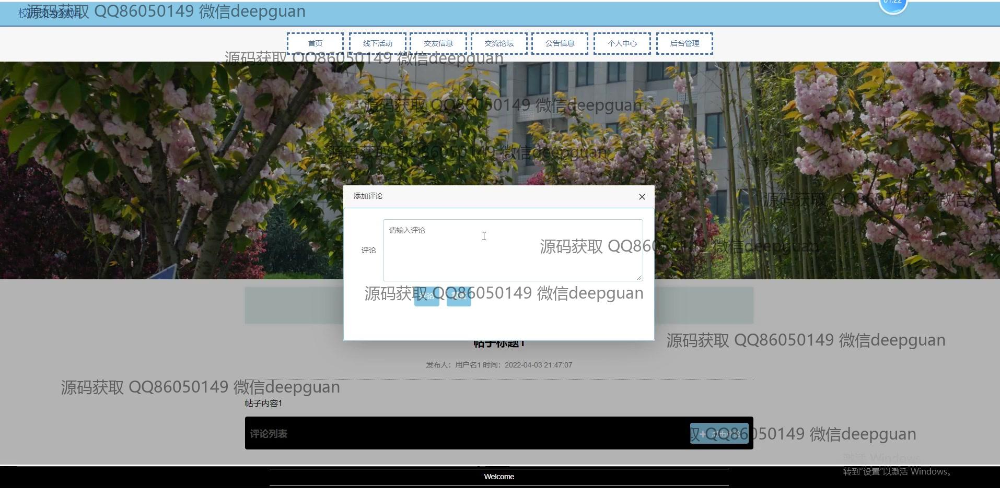
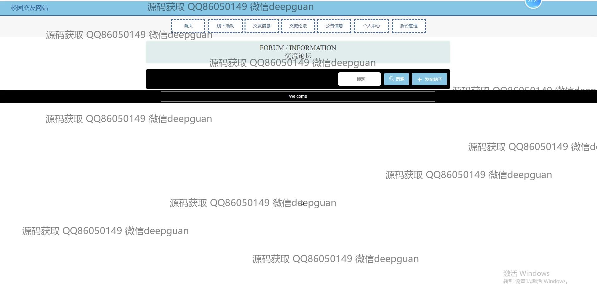
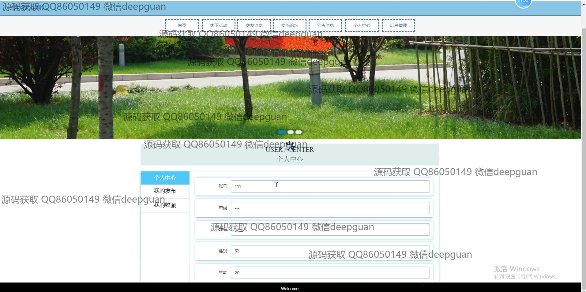
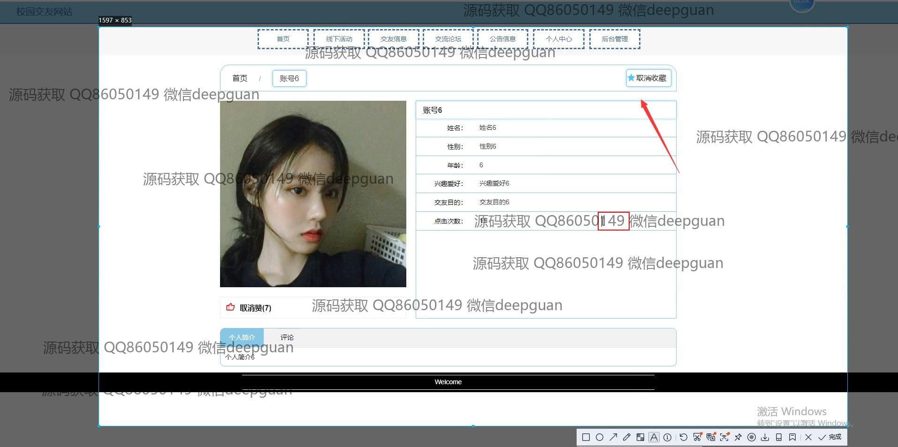
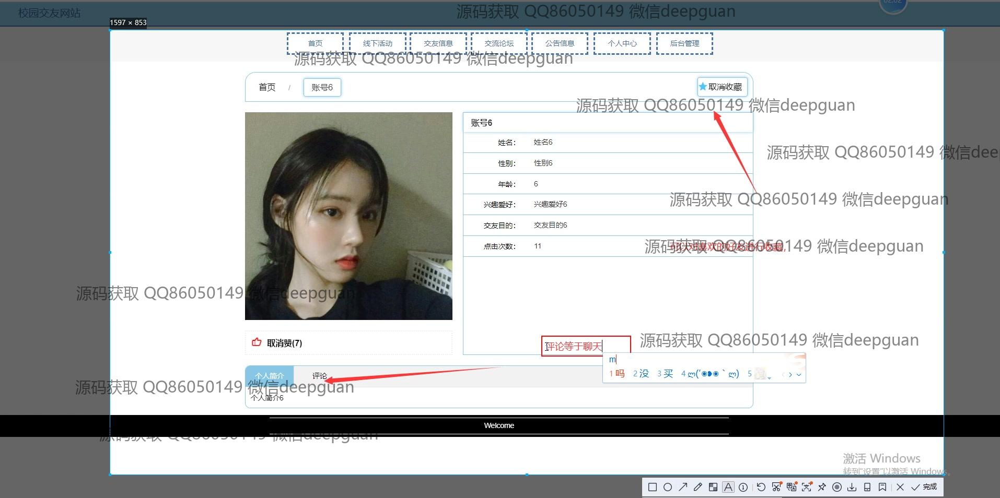
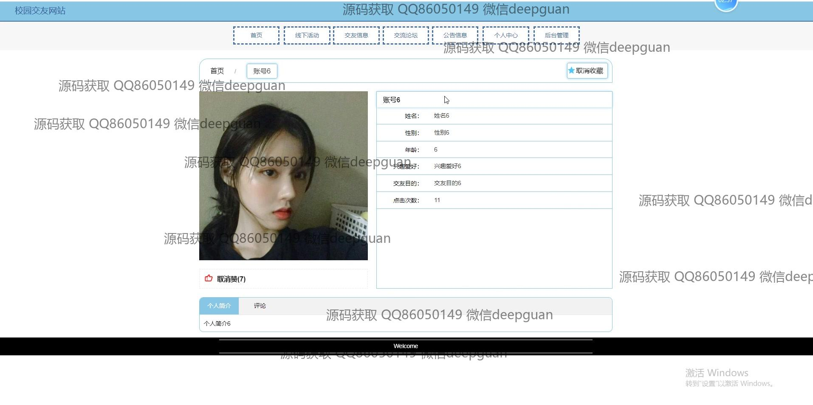
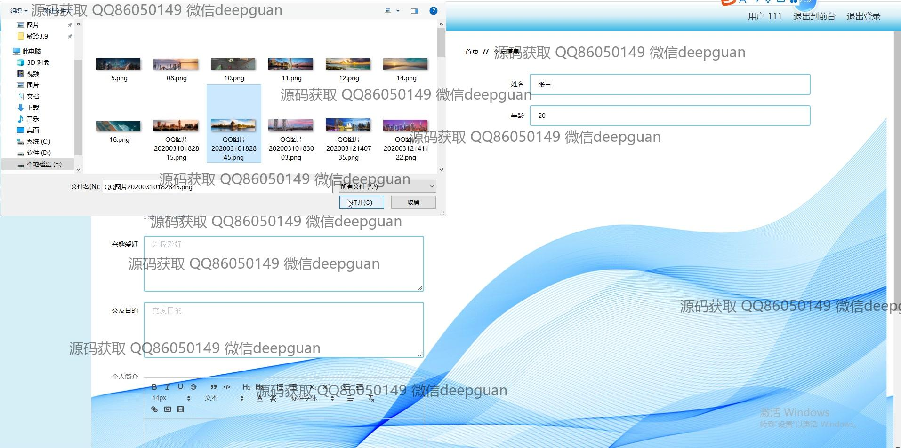
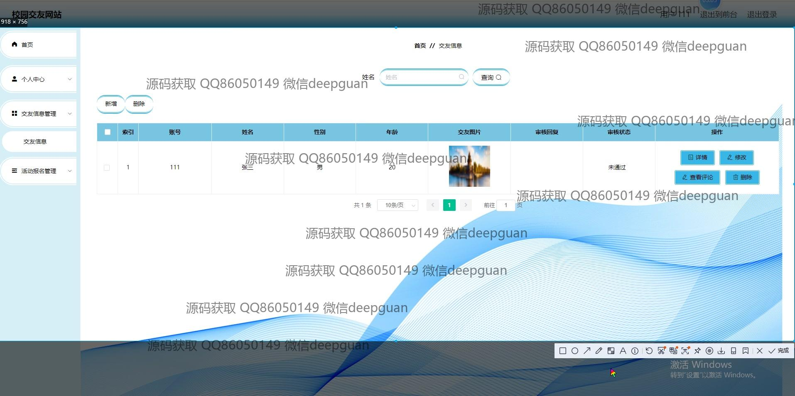
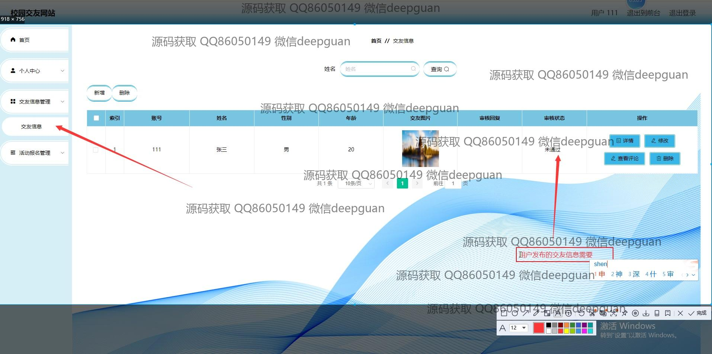
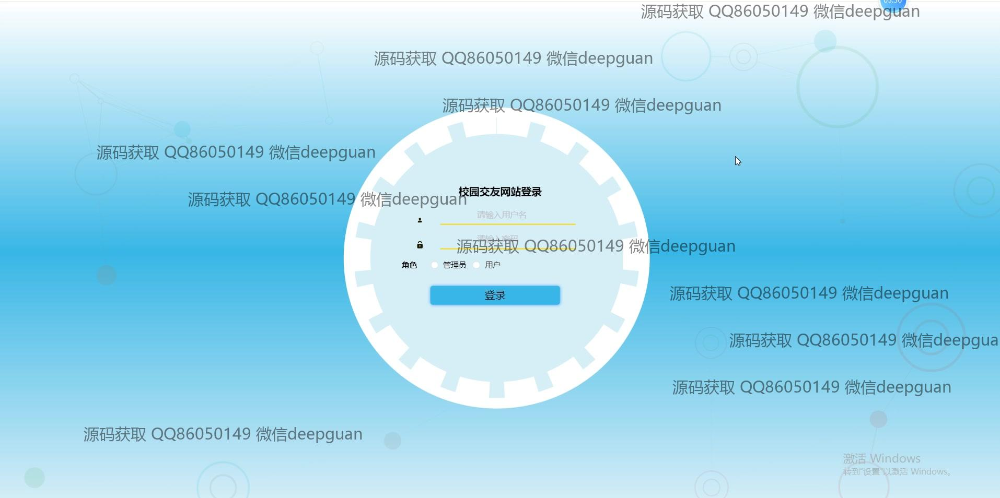
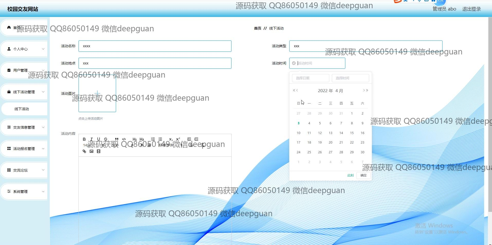
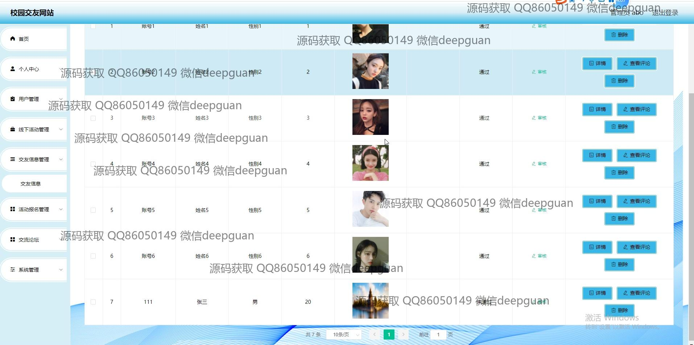
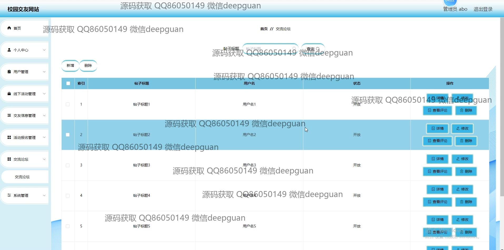
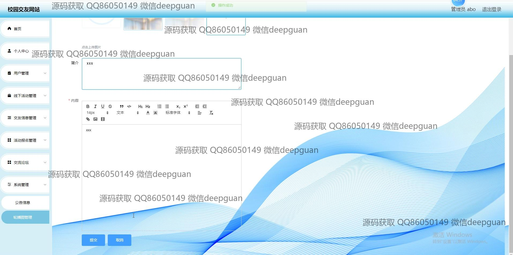

本代码来源于网络,仅供学习参考使用!

